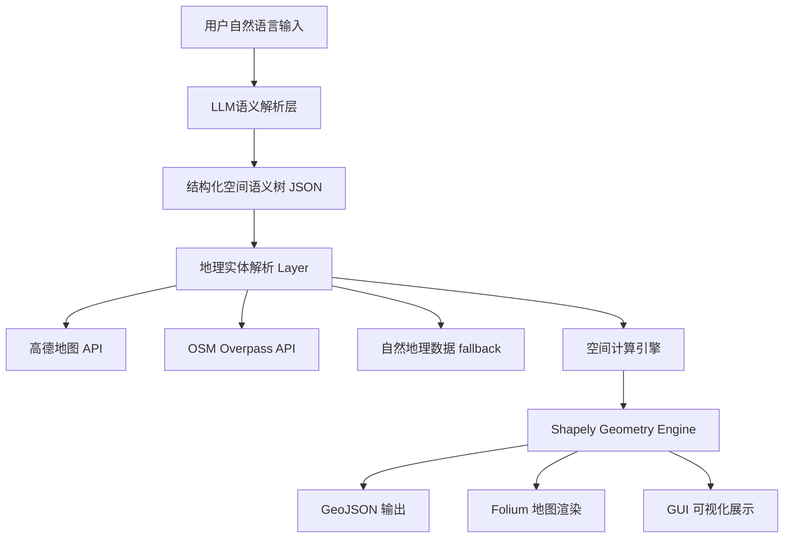

# 🌍 Natural Language Geocoding

> 🧠 基于大语言模型 + GIS 空间计算的自然语言地理编码系统
> 将“人类语言描述的位置”自动转换为**真实地理区域 + 可视化地图**

---
## 运行演示


---

## 🚀 项目亮点

* 🧠 **LLM 驱动空间语义解析**：将自然语言解析为结构化空间表达（JSON语义树）
* 🗺️ **真实 GIS 空间计算**：基于 Shapely 实现区域运算（交集 / 并集 / 缓冲 / 差集）
* 📍 **多源地理数据融合**：高德地图 + OpenStreetMap + 自然地理边界数据
* 🔗 **复杂空间关系支持**：支持“交界处 / 南侧 / 之间 / 距离范围”等表达
* 🌐 **交互式地图生成**：自动生成 Folium 可视化地图
* 🖥️ **CLI + GUI 双模式系统**

---

## 🧠 项目背景

传统地理编码系统（Geocoding API）只能处理：

> “北京天安门广场”

但无法理解：

> “天安门往南500米的区域”
> “深圳大学西南方向的公园”
> “四川和云南交界处”

本项目尝试解决：

> 👉 **自然语言空间理解 → 真实地理空间建模问题**

---

## ⚙️ 系统架构设计



---

## 🔥 核心能力拆解

### 1️⃣ 自然语言空间理解（LLM Layer）

使用大语言模型将输入解析为结构化语义：

```json
{
  "location": "深圳大学",
  "relation": "southwest",
  "target_type": "park",
  "constraint": {
    "type": "distance",
    "value": 500
  }
}
```

👉 解决问题：
自然语言 → 可计算空间表达

---

### 2️⃣ 地理实体解析（Geo Resolution）

支持多源融合策略：

* 📍 高德地图：行政区 / POI 精确定位
* 🌍 OSM：全球开放地图数据补充
* 🔁 fallback：LLM 坐标补全

👉 解决问题：
“模糊地点 → 可计算坐标/边界”

---

### 3️⃣ 空间计算引擎（GIS Core）

基于 Shapely 实现核心空间操作：

* Intersection（交集）
* Union（并集）
* Difference（差集）
* Buffer（距离扩展）
* Directional Constraint（方向过滤）

👉 解决问题：
“语言空间关系 → 几何运算”

---

### 4️⃣ 地图可视化（Rendering Layer）

* Folium 生成交互式地图
* 支持多区域叠加展示
* 输出 HTML 可直接浏览

---

## 🏗️ 技术栈

* Python 3.10+
* 🧠 DeepSeek / LLM API（语义解析）
* 🗺️ AMap 高德地图 API
* 🌍 OpenStreetMap Overpass API
* 📐 Shapely（空间几何计算）
* 🌐 Folium（地图可视化）
* 🖥️ Tkinter（GUI）

---

## 📁 项目结构

```bash
Geocoding/
├── main.py                  # 入口（CLI / GUI）
├── geocoding.py            # 核心编排逻辑
├── prompts.py              # LLM提示词设计（核心）
├── SendMessageToLLM.py     # LLM测试模块
│
├── amap_geocoder.py        # 高德地图封装
├── osm_place_lookup.py     # OSM检索模块
├── natural_earth.py        # 自然地理边界数据
│
├── CreateMap.py            # 地图渲染模块
├── globalMap.html          # 输出地图
│
├── config.json             # 配置（⚠️建议改.env）
└── assets/                 # 可视化截图
```

---

## 🚀 快速启动

### 1️⃣ 安装依赖

```bash
pip install -r requirements.txt
```

---

### 2️⃣ 配置 API Key

建议使用环境变量：

```bash
export DEEPSEEK_API_KEY=xxx
export AMAP_API_KEY=xxx
```

---

### 3️⃣ 运行

#### CLI模式

```bash
python main.py "深圳大学西南方向的公园"
```

#### GUI模式

```bash
python main.py --gui
```

---

## 📊 系统输出

运行后生成：

* 🌐 `globalMap.html` → 可交互地图
* 📦 GeoJSON → 空间结构数据
* 🧭 可视化区域叠加结果

---

## 💡 工程难点 & 解决方案

### ❌ 难点1：自然语言空间表达不确定性

✔ 解决：

* 使用 LLM 做结构化语义抽取
* 引入 constraint schema 约束输出

---

### ❌ 难点2：模糊地理边界问题

✔ 解决：

* 多源地理数据融合（AMap + OSM）
* fallback 坐标补全机制

---

### ❌ 难点3：空间关系不可计算

✔ 解决：

* 将语言关系映射为 GIS 操作（buffer/intersection）
* 用 Shapely 做统一几何表达

---

## 🔥 项目价值

该项目实现了：

> 🧠 NLP（自然语言理解） + GIS（空间计算） + LLM Agent 的融合系统

具备以下工程能力体现：

* LLM Prompt Engineering
* 多源数据融合设计
* 空间计算建模能力
* 系统模块化架构设计
* 可视化工程实现

---


