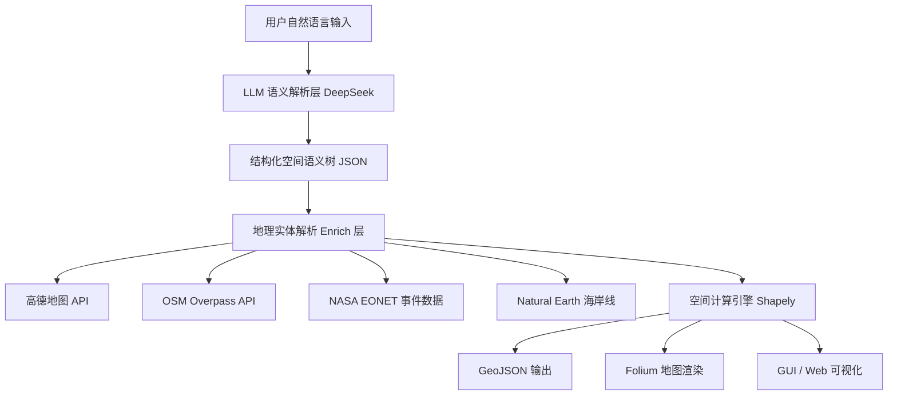

# 🌍 Natural Language Geocoding

> 基于大语言模型 + GIS 空间计算的自然语言地理编码系统
> 把"人类语言描述的位置"自动转成 **真实地理边界 + 可视化地图**

---

## 运行演示


---

## 项目亮点

* **LLM 驱动空间语义解析**：自然语言 → 结构化空间语义树（受 Pydantic 模型约束的 JSON）
* **真实 GIS 空间计算**：基于 Shapely 做区域运算（交 / 并 / 差 / 缓冲 / 方向裁剪）
* **多源地理数据融合**：高德地图 + OpenStreetMap + 自然地理边界 + NASA EONET
* **抽象查询支持**：用地类型（居民区 / 工业区…）与受灾区域（野火 / 洪水）也能落到真实边界
* **多候选择优 Agent**：一句模糊描述扩展成多个解读、并行查询、打分后再由 LLM 裁判
* **交互式地图**：自动生成 Folium 可视化
* **CLI + GUI + Web** 三种入口

---

## 项目背景

传统地理编码只能处理：

> "北京天安门广场"

但无法理解：

> "天安门往南500米的区域"
> "深圳大学西南方向的公园"
> "四川和云南的交界处"
> "2024 年以来被野火影响的帕拉州"
> "南山外国语学校两三公里附近四周的居民区域"

本项目解决：**自然语言空间理解 → 真实地理空间建模**。

---

## 系统架构


```mermaid
graph TD
A[用户自然语言输入] --> B[LLM 语义解析层 DeepSeek]
B --> C[结构化空间语义树 JSON]
C --> D[地理实体解析 Enrich 层]
D --> D1[高德地图 API]
D --> D2[OSM Overpass API]
D --> D3[NASA EONET 事件数据]
D --> D4[Natural Earth 海岸线]
D --> E[空间计算引擎 Shapely]
E --> F[GeoJSON 输出]
E --> G[Folium 地图渲染]
E --> H[GUI / Web 可视化]
```

架构约定：**所有网络 I/O 都发生在 Enrich 阶段**（查地名、查事件、查用地），
`build_geometry` 只做纯几何运算，可离线复现。

---

## 支持的节点类型（14 种）

| 类别 | 节点 |
| --- | --- |
| 地名 | `NamedPlace` |
| 距离 | `Buffer`、`DirectionalConstraint` |
| 方向裁剪 | `DirectionalSubset` |
| 集合运算 | `Intersection`、`Union`、`Difference` |
| 两地之间 | `Between`、`BorderBetween` |
| 边界 / 海岸 | `BorderOf`、`CoastOf`、`OffTheCoastOf` |
| 抽象区域 | `LandUseArea`（用地类型）、`EventAffected`（事件影响） |

---

## 数据源

* **DeepSeek**：自然语言 → 空间语义树（走 OpenAI 兼容接口）
* **高德地图**：行政区 / POI 精确定位（GCJ-02，绘制前自动转 WGS-84）
* **OpenStreetMap Overpass**：地名多边形与 `landuse=*` 地块
* **NASA EONET**：野火 / 洪水等事件点，聚成块后与基础地点求交
* **Natural Earth**：海岸线，用于 `CoastOf` / `OffTheCoastOf`（首次使用自动下载）

---

## 项目结构

```bash
Geocoding/
├── main.py               # 入口：CLI / GUI / 批量 / Agent
├── geocoding.py          # 核心编排：语义树 → 几何
├── models.py             # Pydantic 节点模型（14 种节点 + 用地类别）
├── prompts.py            # LLM 提示词（核心）
├── splitter.py           # 复杂句切分
│
├── amap_geocoder.py      # 高德地图封装
├── place_lookup.py       # 地点查找抽象与降级链
├── osm_place_lookup.py   # OSM Overpass 查询（含耗时治理）
├── natural_earth.py      # 自然地理边界（海岸线）
│
├── event_data.py         # NASA EONET 事件数据源
├── event_aggregate.py    # 事件点聚合为区域
├── candidate_score.py    # 候选结果打分
├── agent.py              # 多 query 扩展 + 多候选择优
│
├── coord_transform.py    # WGS-84 / GCJ-02 坐标转换
├── geometry_utils.py     # 几何工具
├── errors.py             # 异常类型
│
├── app.py                # Web Demo（Streamlit）
├── build_exe.py          # PyInstaller 打包脚本
├── pyproject.toml        # 依赖与打包配置
└── config.example.json   # 配置模板（复制为 config.json 后填 Key）
```

---

## 快速开始

### 1. 安装依赖

```bash
pip install -e .
# Web Demo 额外：pip install -e ".[web]"
```

### 2. 配置 API Key

复制模板并填入自己的 Key：

```bash
cp config.example.json config.json
```

`config.json`：

```json
{
    "deepseek_api_key": "你的 DeepSeek Key",
    "amap_api_key": "你的高德 Web 服务 Key"
}
```

也支持环境变量（优先于 `config.json`）：`DASHSCOPE_API_KEY`、`AMAP_API_KEY`。
`config.json` 已在 `.gitignore` 中，不会被提交。

### 3. 检查环境

```bash
python main.py init
```

会报告海岸线数据是否就绪、两个 Key 是否已配置（只报有无，不回显内容）。

### 4. 运行

```bash
# GUI
python main.py --gui

# 命令行
python main.py --cli "北京天安门广场附近5公里范围内"

# 批量（每行一条，# 开头为注释）
python main.py --batch queries.txt

# 抽象查询用 Agent（更慢，代价约为单次查询的数倍）
python main.py --agent "过去两三年内被火灾影响的亚马逊雨林"
```

---

## 输出

* `globalMap.html` —— 可交互地图
* `output.geojson` / `output_batch.geojson` —— 区域几何数据

---

## 工程难点与解法

* **自然语言空间表达不确定** → LLM 结构化抽取 + Pydantic schema 强约束，非法输出直接拒绝重试
* **模糊地理边界** → 三档降级链：真实多边形 → 高德中心点 → LLM 坐标补全
* **巨型 / 同名地物拖慢查询** → Overpass 端点健康记忆 + 并行竞速 + 分区 bbox 收窄 + 查询级磁盘缓存
* **"居民区""受灾区域"这类抽象词没有节点** → `LandUseArea` / `EventAffected` 落到 OSM `landuse=*` 与 EONET 事件点的真实边界
* **一句话有多种合理理解** → Agent 扩展多解读、并行查询、本地打分 + LLM 裁判择优

---

## 自检

各模块自带离线自检（不联网、不调大模型），用于快速验证未退化：

```bash
python event_data.py
python event_aggregate.py
python candidate_score.py
python osm_place_lookup.py
python agent.py
python geocoding.py --self-check
```

---

## 技术栈

* Python 3.10+
* DeepSeek（语义解析）
* 高德地图 API / OpenStreetMap Overpass / NASA EONET / Natural Earth
* Shapely（空间几何计算）
* Folium（地图可视化）、Tkinter（GUI）、Streamlit（Web Demo）
